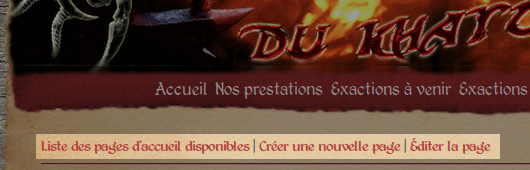
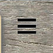

Introduction
============

Pour commencer
--------------

La première chose à faire pour pouvoir éditer une page est de s'authentifier.
Le mécanisme d'authentification est le même que pour l'application Documents,
permettant d'utiliser le même compte utilisateur.

Pour vous connecter, vous pouvez soit ouvrir l'application
`Documents <http://www.compagniefranchedukhatovar.fr/documents>`_, soit aller
directement à `cette adresse <http://www.compagniefranchedukhatovar.fr/>`_.
Aucun lien n'est directement affiché sur le site afin d'éviter le référencement
de la page de connexion, et les tentatives d'authentifications par des robots.

Seuls les utilisateurs ayant au moins le rôle d'*éditeur* dans l'application
peuvent éditer le site dans son intégralité (voir la documentation de
l'application Documents, section sécurité et rôles), et seront donc concernés
par les autres sections.

Les utilisateurs ordinaires sont limités à l'édition de leur page personnelle
et à l'upload de photos pour cette page uniquement. Pour des informations
détaillées, ils peuvent se rendre directement à la page dédiée aux
:doc:`utilisateurs avec droits basiques <regular-users>`. La suite de cette
page ne sera utile qu'aux éditeurs du site.

Une fois connecté
-----------------

Vous remarquerez deux changements. D'abord, différents liens
sous le menu sont apparus (:ref:`voir la capture d'écran ci-dessous <edit-links>`),
vous permettant d'éditer les pages existantes, d'en créer de nouvelles… Pour
plus d'informations sur l'édition des pages, rendez-vous dans la section
:doc:`Édition des pages <edition>`.

.. _edit-links:

   **Les liens disponibles sur la page d'accueil**

Vous noterez également l'apparition d'un bouton en haut à gauche, permettant
l'ouverture d'un panneau latéral (:ref:`voir la capture d'écran ci-dessous <photo-button>`).
Ce panneau permet la gestion des photos du site. Plus d'informations sont à ce
sujet disponibles dans la section :doc:`Upload et gestion des photos <upload>`.

.. _photo-button:

   **Les liens disponibles sur la page d'accueil**
