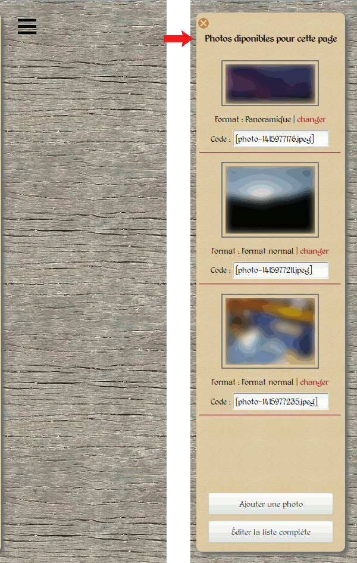
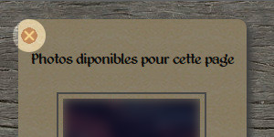
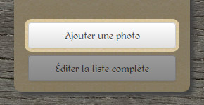
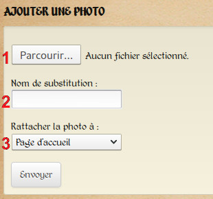
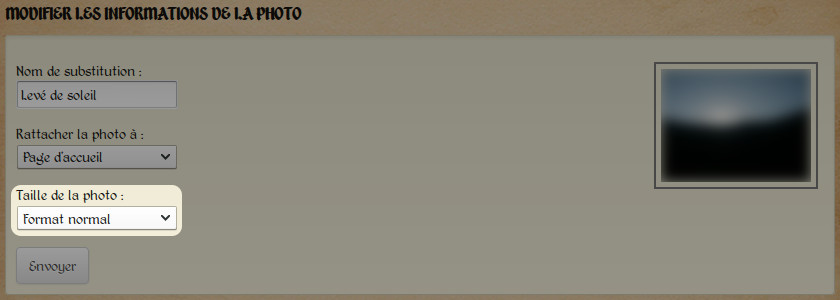
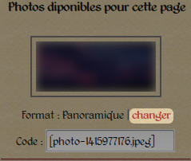
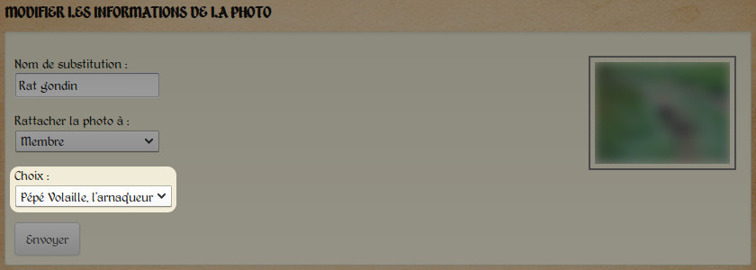
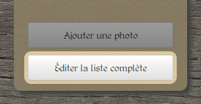
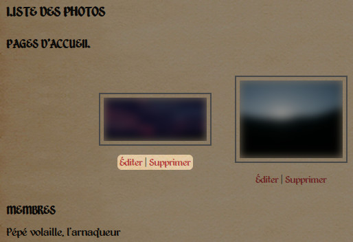

Téléversement et gestion des photos
===================================

Présentation
------------

La gestion des photos est centralisée dans un panneau latéral. Ce dernier
n'est disponible que lorsque vous êtes connecté à votre compte et apparaît après
avoir cliqué sur le bouton prévu à cet effet, en haut à gauche de chaque page
du site web (:ref:`capture d'écran ci-dessous <photo-panel>`).

.. _photo-panel:

   *Le panneau latéral de gestion des photos. À gauche caché, à droite dévoilé.*

Seules les photos de la page courante apparaissent dans ce panneau latéral.
Il est possible d'obtenir une liste ordonnée de toutes les photos du site sur
la page dédiée (allez à la section « :ref:`Gestion des photos <gestion-photos>` »
pour plus d'informations.

Il est possible de cacher le panneau à nouveau en cliquant sur le bouton prévu
à cet effet (:ref:`capture d'écran ci-dessous <photo-panel-close>`).

.. _photo-panel-close:

   *Le bouton de fermeture du panneau latéral.*

Notez que le panneau latéral disparaît automatiquement lors de chaque
changement de page (une future mise à jour du module de gestion des photos
permettra au panneau de rester sorti tant que l'utilisateur le désire).

Le téléversement des photos
---------------------------

Aperçu
^^^^^^

Pour téléverser une photo, commencez par cliquer sur le bouton prévu à cet effet,
en bas du panneau latéral (:ref:`capture d'écran ci-dessous <photo-button-add>`).

.. _photo-button-add:

   *Le bouton de téléversement.*

Vous arriverez alors sur une page affichant :ref:`le contenu suivant <page-photo-upload>` :

.. _page-photo-upload:

   *La page permettant le téléversement de fichiers.*

Les étapes
^^^^^^^^^^

Commencez par sélectionner le fichier que vous désirez téléverser en cliquant
sur le bouton « Parcourir » (:ref:`en 1 <page-photo-upload>` sur la capture d'écran
précédente).

Choisissez ensuite un nom de substitution (:ref:`menu déroulant en 2 <page-photo-upload>`).
Ce nom, pouvant être en plusieurs mots, doit décrire ce que représente la photo,
car il apparaîtra à la place de la photo si celle-ci devient indisponible (effacée
par erreur, renommée/déplacée, bug…).

Enfin, sélectionnez le type de page auquel vous voulez rattacher la photo
(:ref:`menu déroulant en 3 <page-photo-upload>`) :  page d'accueil, page de membre…
Cliquez sur le bouton « Envoyer », et la photo sera téléversée.

.. _differences:

Des différences selon les pages
-------------------------------

Une fois la photo téléversée, vous êtes redirigé sur la page d'édition de cette
photo. En effet, selon le type de page choisi, vous vous retrouvez face à des
choix différents.

Téléversement de photos pour la page d'accueil
^^^^^^^^^^^^^^^^^^^^^^^^^^^^^^^^^^^^^^^^^^^^^^

Si vous avez choisi de rattacher la photo aux pages d'accueil, cette dernière
est alors disponible pour toutes les pages d'accueil du site. À vous de choisir
de l'intégrer ou non dans une page (plus d'information dans la section «
:doc:`Édition des pages d'accueil <edit-home>` »).

Vous devez à présent choisir quel format vous souhaitez attribuer à votre photo :
petit, normal ou panoramique (voir capture d'écran
:ref:`ci-dessous <page-photo-home>`. Le format « normal » est sélectionné par
défaut. Il est idéal lorsque vous placez une seule ou deux photos sur une même
ligne. Le « petit format » est, comme son nom l'indique, plus petit, et permet
de placer 3 ou 4 photos côte à côte sur la page. Finalement, le format
panoramique est destiné aux panoramas très larges, assemblages de plusieurs
photos. Les photos dans ce format occuperont toute la largeur de la page.

.. _page-photo-home:

   *Attribution d'une taille pour une photo liée aux pages d'accueil.*

Il est possible de changer cette taille directement depuis le panneau latéral
(uniquement si vous visualisez/éditez une page d'accueil, sans quoi le panneau
affichera les photos de la page sur laquelle vous vous trouvez). Vous trouverez
en effet sous chaque photo, outre le code destiné à l'insertion des photos
(voir la section :doc:`Édition des pages d’accueil <edit-home>` pour plus de
détails), le format de l'image, et un lien revoyant directement sur la page
permettant d'éditer les informations de la photo
(:ref:`capture d'écran ci-dessous <photo-home-edit>`).

.. _photo-home-edit:

   *Changer rapidement le format d'une photo de page d'accueil.*

Veuillez noter également que si vous avez attribué à une photo un mauvais type
de page, vous pouvez le changer immédiatement. Le bouton « Envoyer »
réactualisera alors la page d'édition de la photo, vous présentant de nouveaux
choix en fonction du nouveau type de page sélectionné.

Téléversement de photos pour les autres pages
^^^^^^^^^^^^^^^^^^^^^^^^^^^^^^^^^^^^^^^^^^^^^

Dans le cas des autres types de pages, vous n'aurez pas à choisir de taille pour
la photo, car celle-ci est définie par la page elle-même. Votre choix consistera
cette fois à choisir à quelle page précise vous devez liée la photo
(:ref:`voir la capture d'écran ci-dessous <page-photo-member>`).

.. _page-photo-member:

   *Un exemple avec le choix de la page de membre à laquelle on veut lier la photo.*

En effet, dans le cas des pages d'accueil, toutes les photos liées sont
disponibles pour toutes les pages d'accueil. En revanche, dans le cas par
exemple d'une page de membre, chaque photo ne peut être liée qu'à une seule
page de membre et aucune autre. Cela n'aurait aucun sens de faire apparaître
la photo d'un membre à la fois sur sa page et sur celle d'un autre membre.

.. _gestion-photos:

Gestion des photos
------------------

Outre le téléversement des photos, vous avez également la possibilité de gérer
l'ensemble des photos du site. En cliquant sur le bouton situé tout en bas du
panneau latéral (:ref:`capture d'écran ci-dessous <photo-button-edit>`), vous
obtiendrez une liste de toutes les photos, classées par page d'appartenance.

.. _photo-button-edit:

   *Accéder et gérer l'intégralité des photos du site*

Sous chaque photo, vous trouverez deux liens pour respectivement éditer et
supprimer la photo (:ref:`capture d'écran ci-dessous <photo-edit-links>`). Lors
de la suppression, un message de confirmation vous demandera de confirmer votre
choix pour éviter tout effacement non désiré.

.. _photo-edit-links:

   *Un aperçu de la page de gestion des photos*

Pour l'édition des photos, veuillez vous référer à la section «
:ref:`Des différences selon les pages <differences>` ».

Un dernier point : supprimer la page à laquelle est liée la photo (accueil,
membre…) ne supprimera pas la photo, mais la fera apparaître comme orpheline
dans la liste. Il est ensuite possible de la supprimer ou de la rattacher à une
nouvelle page.
